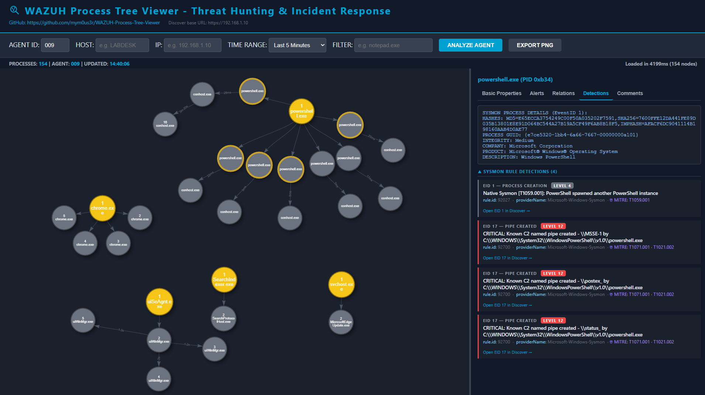
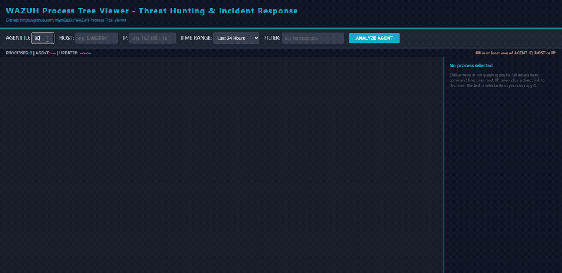
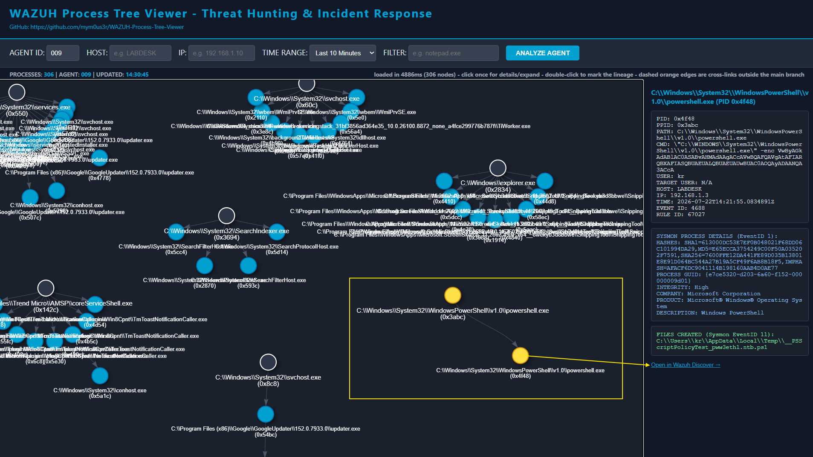

# WAZUH Process Tree Viewer (WPTV)

WAZUH Process Tree Viewer (WPTV) is a high-performance forensic visualization tool designed for the Wazuh ecosystem. It transforms raw Windows Security Logs (Event ID 4688) into interactive, draggable relationship graphs, enabling analysts to trace process lineages (Parent-Child) during Threat Hunting and Incident Response (IR) operations - enriched with correlated Sysmon telemetry (EID 1 to 29) for hashes, network connections, loaded DLLs, dropped files, clipboard changes, registry modifications, pipe events, and more.

--------------------------------
> Version: 2.1
> Last Updated: 2026-07-26
> Wazuh Compatibility: 4.14.4 / 4.14.5
> OpenSearch Dashboards: 2.19.3
> Companion Sysmon ruleset (recommended): [Native Sysmon Rewrite by m0us3r](https://github.com/mym0us3r/Unified-Sysmon-Configs)



## Project Architecture & File Structure

1. `server.py`: Entrypoint. Flask server handling web routing (`/api/process-tree`, `/api/process-tree/expand`) and serving the frontend. Structured logging with RotatingFileHandler.
2. `logic.py`: Backend logic. Wazuh Indexer (primary) + `alerts.json` file scan (fallback). Correlates Sysmon EID 1-29, handles UTC timezone normalization, and builds/enriches the process tree with BFS creation-order numbering.
3. `public/index.html`: Frontend. Interactive UI powered by `vis-network.js`, radial layout, Alerts/Detections/Relations tabs, wave-drag animation, and Dark Mode.
4. `requirements.txt`: Dependencies. Required Python libraries for the environment.
5. `wazuh-process-tree.service`: SystemD configuration template for background service management.
6. `public/favicon.svg` / `public/favicon.ico`: Browser tab icon and in-page navbar icon.

## Companion Sysmon Ruleset

WPTV's Sysmon correlation only surfaces data that Wazuh actually writes to `alerts.json` - if your Sysmon ruleset suppresses an event type at the source or never escalates it past level 0, WPTV has nothing to correlate. This project was developed and validated against [Native Sysmon Rewrite by m0us3r](https://github.com/mym0us3r/Unified-Sysmon-Configs), which also documents two ruleset bugs found during that validation (both present in the stock Wazuh 4.14.4 ruleset as well):

- A missing `-enc` abbreviation in the PowerShell Base64-encoded-command detection (rules `92057`/`92059`/`92071`), which prevented the most common real-world invocation from ever escalating past a low-severity generic rule.
- A missing end-of-string anchor in rule `92213` ("Executable file dropped in folder commonly used by malware"), which caused legitimate `.json` files to be misclassified as executables.

### Sysmon EventID coverage map

| EventID | What it is | Behavioral rules exist? | Correlated by WPTV? |
|---|---|---|---|
| 1 | Process Creation | Yes - multiple modules | **Yes** - hashes, ProcessGuid, integrity, product/company |
| 3 | Network Connection | Yes - suspicious outbound | **Yes** - drawn as network edges + Relations tab |
| 6 | Driver Load | Yes - BYOVD / EDR-killer | **Yes** - Alerts tab (rule + MITRE) |
| 7 | Image Load (DLL) | Yes - `vaultcli.dll` tiered | **Yes** - Detections tab |
| 8 | CreateRemoteThread | Yes - injection / lateral movement | **Yes** - Alerts tab (rule + MITRE) |
| 9 | Raw Access Read | Yes - credential access via disk | **Yes** - Alerts tab (rule + MITRE) |
| 10 | Process Access | Yes - LSASS / sensitive memory | **Yes** - Alerts tab (rule + MITRE) |
| 11 | File Create | Yes - suspicious file creation | **Yes** - Detections tab |
| 13 | Registry Value Set | Yes - persistence / defense evasion | **Yes** - Alerts tab (rule + MITRE) |
| 17 | Pipe Created | Yes - Cobalt Strike named pipe C2 | **Yes** - Alerts tab (rule + MITRE) |
| 18 | Pipe Connected | Yes - Cobalt Strike named pipe C2 | **Yes** - Alerts tab (rule + MITRE) |
| 20 | WmiEvent Consumer | Yes - WMI-based persistence | **Yes** - Alerts tab (rule + MITRE) |
| 24 | Clipboard Change | Yes - ClickFix (T1204.004) | **Yes** - Alerts tab (rule + MITRE) |
| 25 | Process Tampering | Yes - hollowing / herpaderping | **Yes** - Alerts tab (rule + MITRE) |
| 29 | File Executable Detected | Yes - new PE drop | **Yes** - Alerts tab (rule + MITRE) |
| 2, 4, 5 | FileCreateTime, service state, process terminate | Group-tagged only, no behavioral rules | No |

## Technical Report

A full technical report documenting the development, the Sysmon correlation architecture, the adversarial C2 simulation methodology used for validation, and the ruleset bugs above is available at `docs/WPTV_Relatorio_Tecnico_PT.docx` (Brazilian Portuguese).

## Changelog

See [`CHANGELOG.md`](CHANGELOG.md) for the full version history.

## Installation & Setup

### 1. Directory Structure
We recommend deploying the plugin within the Wazuh dashboard directory:
```bash
mkdir -p /usr/share/wazuh-dashboard/plugins/process_tree_api/public
cd /usr/share/wazuh-dashboard/plugins/process_tree_api
# copy server.py, logic.py, requirements.txt here
# copy index.html to public/
```

### 2. Virtual Environment
Isolate dependencies to prevent system conflicts:
```bash
python3 -m venv venv
source venv/bin/activate
pip install -r requirements.txt
```

### 3. Critical Permissions
The service must be executed by the dashboard user:
```bash
chown -R wazuh-dashboard:wazuh-dashboard /usr/share/wazuh-dashboard/plugins/process_tree_api
chmod -R 755 /usr/share/wazuh-dashboard/plugins/process_tree_api
```

### 4. Log Directory
```bash
mkdir -p /var/log/wazuh-process-tree
chown wazuh-dashboard:wazuh-dashboard /var/log/wazuh-process-tree
```

### 5. Wazuh Indexer Credentials (recommended)

WPTV queries the Wazuh Indexer directly as its primary data source. Create a read-only user in the Indexer with access to `wazuh-alerts-*`, then configure the credentials:

```bash
mkdir -p /etc/wazuh-process-tree/certs
cp /etc/wazuh-indexer/certs/root-ca.pem /etc/wazuh-process-tree/certs/

cat > /etc/wazuh-process-tree/wptv.env << 'EOF'
WPTV_INDEXER_URL=https://127.0.0.1:9200
WPTV_INDEXER_INDEX=wazuh-alerts-*
WPTV_INDEXER_USER=wptv_svc
WPTV_INDEXER_PASSWORD=<your_password>
WPTV_INDEXER_CA_CERT=/etc/wazuh-process-tree/certs/root-ca.pem
EOF

chown wazuh-dashboard:wazuh-dashboard /etc/wazuh-process-tree/wptv.env
chmod 600 /etc/wazuh-process-tree/wptv.env
```

If `WPTV_INDEXER_URL` is not set, WPTV automatically falls back to scanning the `alerts.json` log files.

### 6. Discover Link Base URL

Every node's "Open in Wazuh Discover" link is built from a JavaScript constant, `WAZUH_DASHBOARD_BASE_URL`, in the **first lines** of the `<script>` block in `public/index.html`:

```js
const WAZUH_DASHBOARD_BASE_URL = `https://${window.location.hostname}`;
```

**How to check if you need to change it:**
1. Open WPTV in your browser and look at the navbar - it shows a live label: `Discover base URL: https://<detected-value>`.
2. Compare that value against the actual URL you use to log into your Wazuh Dashboard.
3. If they match (the common case: WPTV reverse-proxied on the same host as the Dashboard, just a different port) - do nothing, it already works.
4. If they don't match, edit the constant directly:
   ```js
   const WAZUH_DASHBOARD_BASE_URL = 'https://your-actual-dashboard-host-or-fqdn';
   ```

## Service Management (SystemD)

Create the service file:

```bash
sudo nano /etc/systemd/system/wazuh-process-tree.service
```

```ini
[Unit]
Description=Wazuh Process Tree Viewer (WPTV)
After=network.target

[Service]
Type=simple
User=wazuh-dashboard
WorkingDirectory=/usr/share/wazuh-dashboard/plugins/process_tree_api
EnvironmentFile=/etc/wazuh-process-tree/wptv.env
ExecStart=/usr/share/wazuh-dashboard/plugins/process_tree_api/venv/bin/gunicorn \
  --workers 4 --bind 0.0.0.0:5000 --timeout 120 server:app
Restart=always
RestartSec=5

[Install]
WantedBy=multi-user.target
```

`gunicorn` is included in `requirements.txt` and installed automatically inside the venv in step 2 above.

### Management Commands
```bash
sudo systemctl start wazuh-process-tree      # Start
sudo systemctl stop wazuh-process-tree       # Stop
sudo systemctl status wazuh-process-tree     # Check status
sudo systemctl enable wazuh-process-tree     # Enable on boot
tail -f /var/log/wazuh-process-tree/wptv.log # Real-time log
```

## Usage Guide

> Ensure **Audit Process Creation** is enabled on Windows targets to generate Event ID 4688, and that Sysmon is installed and forwarding to the Wazuh agent channel if you want the correlation features.

- Access the tool via browser: `https://<YOUR_WAZUH_IP>:5000`
- Enter **one** of: Agent ID, Host, or IP (e.g. `009`, `LABDESK`, or `192.168.1.3`).
- Select the **Time Range** - presets from 5 minutes to 30 days, or a custom range (WPTV uses UTC comparison for forensic precision).
- Optionally add a **Filter** by process name (e.g. `chrome.exe`) to scope the graph.
- Click **Analyze Agent**.

### Graph Interactions

| Action | Result |
|--------|--------|
| Single click on a node | Opens the detail panel (Basic Properties, Alerts, Relations, Detections) |
| Double click on a node | Colors the entire subtree blue |
| Click on empty background | Resets all subtrees: parent processes return to yellow, children to gray |
| Drag the divider bar | Resizes the detail panel width |

### Understanding the Graph

- **Yellow node #1** - Parent Process (outside the queried time range, always numbered #1 in its subtree)
- **Gray nodes #2, #3...** - Observed processes, numbered in creation order within their subtree
- **Gold border** - Sysmon telemetry correlated (EID 1, 7, or 11 - hashes, DLLs, or files)
- **Red border** - Wazuh detection rules fired for this process (visible even without Sysmon enrichment)
- **Dashed green line** - Network connection (Sysmon EID 3)
- **Dashed orange line** - Cross-link (same process referenced in two different subtrees)
- **Blue diamond node** - External IP from EID 3 correlation; click for a direct Discover link to all EID 3 events for that destination

### Detail Panel Tabs

| Tab | Content |
|-----|---------|
| **Basic Properties** | Timestamp, executable path, PID, user, host, Wazuh rule info, direct Discover link |
| **Alerts** | Timeline of every Wazuh rule that fired for this process - level, description, MITRE tactic/technique, EID, timestamp. Badge turns red when detections exist. |
| **Relations** | ASCII process lineage tree + Sysmon EID 3 network connections |
| **Detections** | Sysmon EID 1 (hashes, ProcessGuid, integrity), EID 7 (loaded DLLs), EID 11 (created files). Each section labeled with its source EID and a direct Discover link. |

## WPTV Demo


Sped up ~6x from the original 102-second recording (real time from launch to the Discover pivot). Full-speed video: [`img/WPTV_-_demo.mp4`](img/WPTV_-_demo.mp4).



## Special Thanks

I would like to extend my sincere gratitude to **AwwalQuan** for their invaluable support, guidance, and contributions during the development of this project. And also to the **Wazuh Community** for providing an amazing open-source platform for security research.

## Goal

This project is under active development and will continue to evolve. The destination is not the last stop, but a new point of departure.

## Contributors

[@AwwalQuan](https://github.com/AwwalQuan)

[@wazuh](https://github.com/wazuh)

## License

Distributed under the MIT License. See LICENSE for more information.
