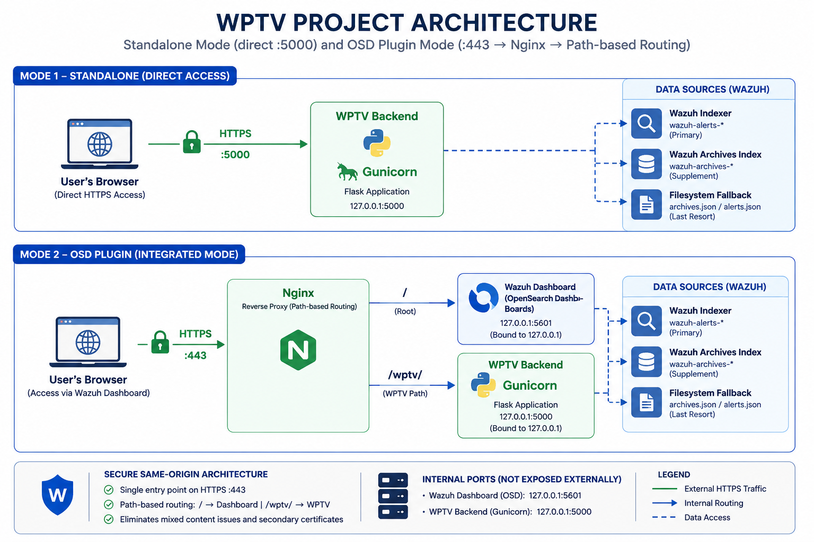
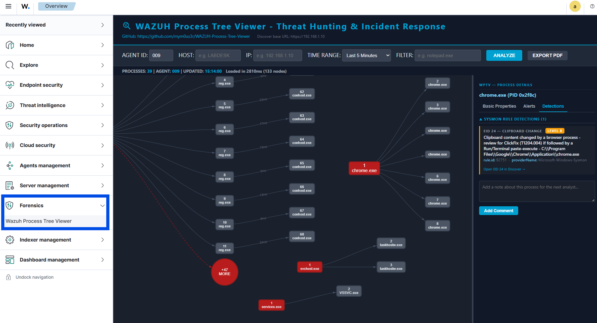
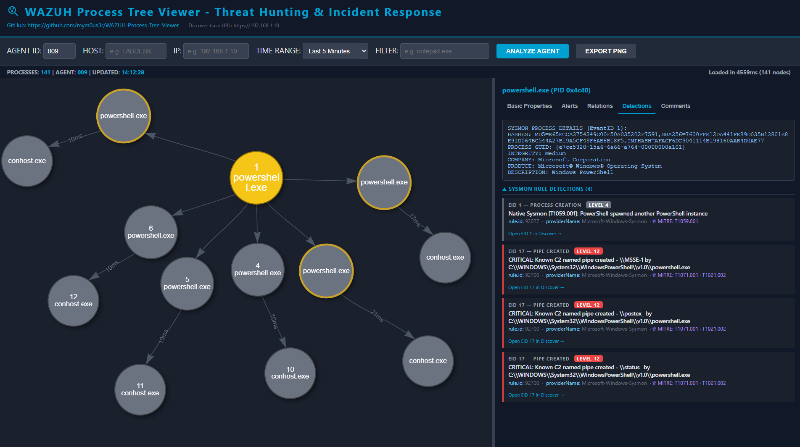
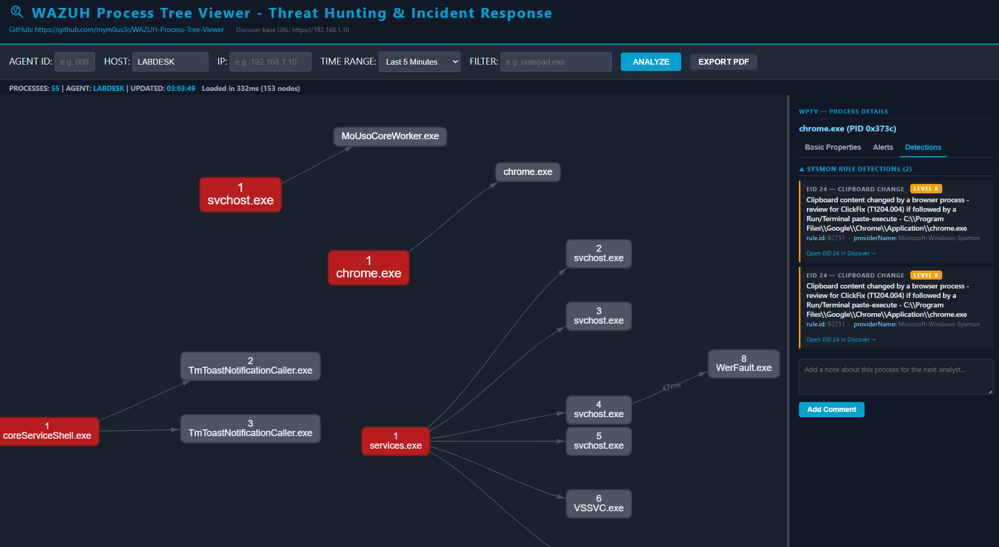
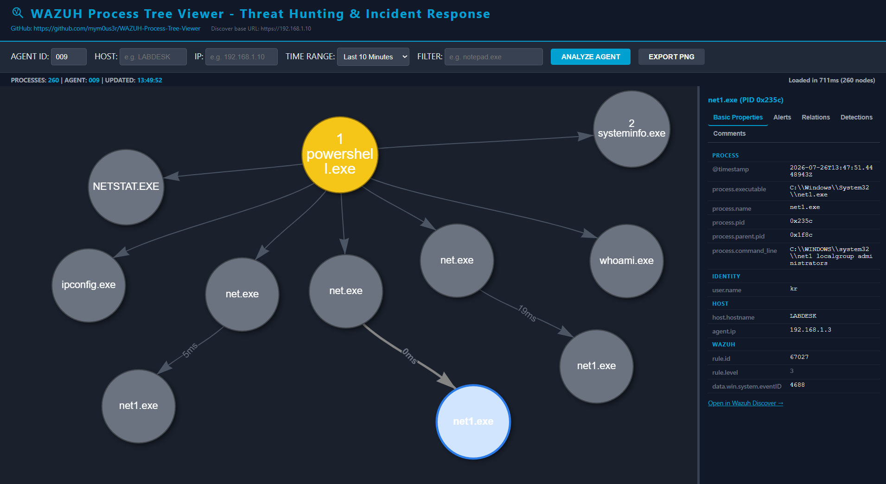
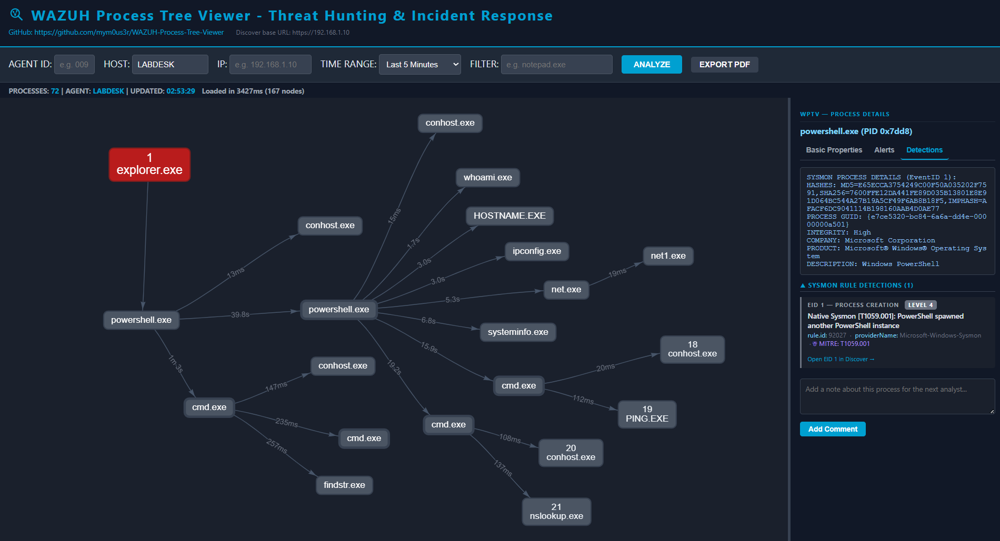

# WAZUH Process Tree Viewer (WPTV)

WPTV is an independent OpenSearch Dashboards UI Plugin that provides graph-based forensic investigation capabilities within the Wazuh Dashboard without modifying its core source code.

WPTV transforms raw Windows Security Logs (Event ID 4688) and Sysmon telemetry into interactive, draggable process graphs - enabling analysts to visualize process relationships and trace process lineages during Threat Hunting and Incident Response operations. Correlated with all 15 Sysmon detection EIDs and 23 critical Windows Audit Event IDs for hashes, network connections, loaded DLLs, dropped files, clipboard changes, registry modifications, pipe events, privilege escalation, persistence, and more.

> **Important:** WPTV is designed for Windows process telemetry. The selected Wazuh agent must be connected and actively sending Windows Security and/or Sysmon events to Wazuh. Linux agents may appear in the Wazuh environment, but they do not provide the Windows process telemetry required to build WPTV process graphs.

> **Disclaimer:** WPTV is an independent open-source project developed as part of my contributions to the Wazuh community through the Wazuh Ambassador Program. While it is built to integrate with and enhance the Wazuh platform, it is not an official Wazuh product and is not maintained or endorsed by the Wazuh team. The name "Wazuh" is used solely to describe compatibility with the platform.

---

> **Version:** 2.1
> **Last Updated:** 2026-08-13
> **Wazuh Compatibility:** 4.14.4 / 4.14.7
> **OpenSearch Dashboards:** 2.19.4 / 2.19.5
> **Companion Sysmon ruleset (recommended):** [Native Sysmon Rewrite by m0us3r](https://github.com/mym0us3r/Unified-Sysmon-Configs)

### Compatibility Note

WPTV v2.1 was originally developed and validated on **Wazuh 4.14.4**, which uses **OpenSearch Dashboards 2.19.4**.

Wazuh 4.14.7 uses **OpenSearch Dashboards 2.19.5**. Because OpenSearch Dashboards plugins declare the dashboard version they are compatible with, the WPTV plugin manifest must match the installed OpenSearch Dashboards version.

The WPTV backend and data-processing architecture remain unchanged. When deploying WPTV on Wazuh 4.14.7, an additional compatibility adjustment is required in the OpenSearch Dashboards plugin manifest.

> **Wazuh 4.14.4:** OpenSearch Dashboards 2.19.4 - the WPTV plugin manifest must declare `2.19.4`.
>
> **Wazuh 4.14.7:** OpenSearch Dashboards 2.19.5 - the WPTV plugin manifest must declare `2.19.5`.


## Deployment Modes

WPTV can be reached in two ways, both served through the same unified Nginx reverse proxy on port 443:

- **Standalone access** - navigate directly to `https://<YOUR_WAZUH_IP>/wptv/` in the browser, outside the Wazuh Dashboard shell. Useful for isolated use or troubleshooting without opening the Dashboard.
- **Integrated access (OSD Plugin)** - the OSD plugin registers WPTV as a native sidebar entry under Forensics, embedding the same `/wptv/` endpoint in an iframe at `/app/wptv`.

Both paths resolve to the same Gunicorn backend through the Nginx `/wptv/` location block, so there is a single certificate, a single external port, and a single place to check when something breaks.

> **Historical note:** in the early stage of the project (Wazuh 4.14.4, roughly seven months before v2.1), Gunicorn bound directly to `0.0.0.0:5000` and was reachable externally on that port without Nginx in front of it. That direct-port model has been retired. Since v2.1, Gunicorn binds to `127.0.0.1:5000` (loopback only, see the systemd unit below) and Nginx is the sole external entry point for both standalone and OSD-integrated access. Port 5000 is not reachable from outside the host, and any bookmark or script still pointing at `https://<host>:5000` needs to be updated to `https://<host>/wptv/`.

## Project Architecture & File Structure

<p align="center">
  
</p>

> **Note:** Nginx centralizes all external HTTPS traffic on port 443 with path-based routing for both standalone and OSD-integrated access. The iframe uses the same HTTPS origin as standalone access, eliminating mixed-content issues and secondary certificates.


WPTV v2.1 is deployed as a native OpenSearch Dashboards UI Plugin, accessible directly from the Wazuh Dashboard sidebar under Forensics.



WPTV consists of two independent components:

**WPTV Backend** (`process_tree_api/`)
- `server.py`: Flask entrypoint - routing, logging, CORS, CSP headers
- `logic.py`: Core backend - Indexer query, archive scan, `build_tree`, BFS numbering. Wazuh Indexer as primary (`search_after` pagination up to 100k events), `wazuh-archives-*` supplement index for events without rules, filesystem fallback
- `requirements.txt`: Python dependencies
- `wptv_example.env`: Environment variables template (copy to `wptv.env`)
- `wazuh-process-tree.service`: SystemD unit template
- `public/index.html`: Frontend - vis-network.js, LR layout, PDF export, dark mode
- `public/favicon.svg` / `public/favicon.ico`: Browser tab icon

**WPTV Dashboard Plugin** (`wptv_plugin/`)
- `opensearch_dashboards.json`: OSD plugin manifest
- `package.json`
- `install.sh`: Plugin installation script (copy, permissions, restart)
- `target/public/wptv.plugin.js`: Pre-built bundle (~2.5KB, no compilation required)
- `target/public/wptv.plugin.js.gz`: Compressed bundle
  
## Companion Sysmon Ruleset

WPTV correlates Sysmon data from two sources: `wazuh-alerts-*` (Indexer, fast path) for events that triggered a Wazuh rule, and `wazuh-archives-*` (or filesystem archives) for all events regardless of rule - including Sysmon telemetry captured but never escalated.

Events like EID 24 (Clipboard Change) from any process appear in the Alerts tab even without a rule firing, as long as the event was ingested by Wazuh.

This project was developed and validated against [Native Sysmon Rewrite by m0us3r](https://github.com/mym0us3r/Unified-Sysmon-Configs), which also documents two ruleset bugs found during that validation (both present in the stock Wazuh 4.14.4 ruleset as well):

- A missing `-enc` abbreviation in the PowerShell Base64-encoded-command detection (rules `92057`/`92059`/`92071`), which prevented the most common real-world invocation from ever escalating past a low-severity generic rule.
- A missing end-of-string anchor in rule `92213` ("Executable file dropped in folder commonly used by malware"), which caused legitimate `.json` files to be misclassified as executables.

### Sysmon EventID coverage map

| EventID | What it is | Behavioral rules exist? | Correlated by WPTV? |
|---|---|---|---|
| 1 | Process Creation | Yes - multiple modules | **Yes** - hashes, ProcessGuid, integrity, product/company |
| 3 | Network Connection | Yes - suspicious outbound | **Yes** - drawn as network edges + Detections tab |
| 6 | Driver Load | Yes - BYOVD / EDR-killer | **Yes** - Alerts tab (rule + MITRE) |
| 7 | Image Load (DLL) | Yes - `vaultcli.dll` tiered | **Yes** - Detections tab |
| 8 | CreateRemoteThread | Yes - injection / lateral movement | **Yes** - Alerts tab (rule + MITRE) |
| 9 | Raw Access Read | Yes - credential access via disk | **Yes** - Alerts tab (rule + MITRE) |
| 10 | Process Access | Yes - LSASS / sensitive memory | **Yes** - Alerts tab (rule + MITRE) |
| 11 | File Create | Yes - suspicious file creation | **Yes** - Detections tab |
| 13 | Registry Value Set | Yes - persistence / defense evasion | **Yes** - Alerts tab (rule + MITRE) |
| 17 | Pipe Created | Yes - Cobalt Strike named pipe C2 | **Yes** - Alerts tab (rule + MITRE) |
| 18 | Pipe Connected | Yes - Cobalt Strike named pipe C2 | **Yes** - Alerts tab (rule + MITRE) |
| 20 | WmiEvent Consumer | Yes - WMI-based persistence | **Yes** - Alerts tab (rule + MITRE) |
| 24 | Clipboard Change | Yes - ClickFix (T1204.004) | **Yes** - Alerts tab (rule + MITRE) |
| 25 | Process Tampering | Yes - hollowing / herpaderping | **Yes** - Alerts tab (rule + MITRE) |
| 29 | File Executable Detected | Yes - new PE drop | **Yes** - Alerts tab (rule + MITRE) |
| 2, 4, 5 | FileCreateTime, service state, process terminate | Group-tagged only, no behavioral rules | No |

### Windows Audit Event ID coverage

Beyond Sysmon, WPTV surfaces critical Windows Security and System Event IDs when indexed by Wazuh, handled transparently via `_normalize_pid()` to bridge hexadecimal and decimal PID formats.

| Event ID | Description | Category |
|---|---|---|
| 1102 | Security log cleared | Audit tampering |
| 4104 | PowerShell script block logging | Fileless malware / obfuscation |
| 4616 | System time changed | Log tampering / evasion |
| 4624 | Successful logon | Lateral movement baseline |
| 4625 | Failed logon | Brute force / credential attack |
| 4648 | Explicit credential logon | Pass-the-Hash / RunAs |
| 4663 | Object access attempt | Data exfiltration |
| 4672 | Special privileges assigned | Privilege escalation |
| 4698 | Scheduled task created | T1053 persistence |
| 4702 | Scheduled task updated | Persistence evasion |
| 4719 | Audit policy changed | Defense evasion |
| 4720 | User account created | Backdoor account |
| 4726 | User account deleted | Covering tracks |
| 4728 | Member added to global group | Privilege escalation |
| 4732 | Member added to local group | Privilege escalation |
| 4740 | Account lockout | Brute force indicator |
| 4768 | Kerberos TGT requested | Kerberoasting / Golden Ticket |
| 4769 | Kerberos service ticket requested | Lateral movement |
| 4771 | Kerberos pre-auth failed | Credential attacks |
| 4776 | NTLM credential validation | Pass-the-Hash / NTLM relay |
| 4964 | Special groups assigned | Privileged group monitoring |
| 7045 | New service installed | T1543 persistence |
| 4689 | Process terminated | Process activity |

## Changelog

See [`CHANGELOG.md`](CHANGELOG.md) for the full version history.

## Installation & Setup

### 1. Clone the Repository and Prepare the Backend

Clone the repository into the current directory:

```
git clone https://github.com/mym0us3r/WAZUH-Process-Tree-Viewer.git
```

Enter the cloned repository:

```
cd WAZUH-Process-Tree-Viewer
```

Create the WPTV backend directory:

```
mkdir -p /usr/share/wazuh-dashboard/plugins/process_tree_api/public
```

Copy the backend files:

```
cp process_tree_api/server.py \
   process_tree_api/logic.py \
   process_tree_api/requirements.txt \
   /usr/share/wazuh-dashboard/plugins/process_tree_api/

cp process_tree_api/wptv_example.env \
   /etc/wazuh-process-tree/wptv.env

```

Copy the frontend files:

```
cp process_tree_api/public/index.html \
   process_tree_api/public/favicon.ico \
   process_tree_api/public/favicon.svg \
   /usr/share/wazuh-dashboard/plugins/process_tree_api/public/
```

After a complete deployment:

```
/usr/share/wazuh-dashboard/plugins/process_tree_api/
├── logic.py
├── public
│   ├── favicon.ico
│   ├── favicon.svg
│   └── index.html
├── requirements.txt
├── server.py
└── venv/
    └── bin/
        ├── gunicorn
        └── python3

```

### 2. Virtual Environment

Isolate dependencies to prevent system conflicts:

```
cd /usr/share/wazuh-dashboard/plugins/process_tree_api

python3 -m venv venv
source venv/bin/activate
pip install -r requirements.txt
deactivate
```

### 3. Critical Permissions

The service must be executed by the dashboard user:

```
chown -R wazuh-dashboard:wazuh-dashboard /usr/share/wazuh-dashboard/plugins/process_tree_api
chmod -R 755 /usr/share/wazuh-dashboard/plugins/process_tree_api
```

### 4. Log Directory

```
mkdir -p /var/log/wazuh-process-tree
chown wazuh-dashboard:wazuh-dashboard /var/log/wazuh-process-tree
```

### 5. Wazuh Indexer Credentials

WPTV queries the Wazuh Indexer directly as its primary data source. Create a dedicated read-only service user (`wptv_svc`) with access to `wazuh-alerts-*` and `wazuh-archives-*`.

Create the role:

```
curl -sk -X PUT "https://127.0.0.1:9200/_plugins/_security/api/roles/wptv_role" \
  -H "Content-Type: application/json" \
  -u "admin:<admin_password>" \
  -d '{
    "cluster_permissions": [
      "cluster:monitor/main"
    ],
    "index_permissions": [{
      "index_patterns": [
        "wazuh-alerts-*",
        "wazuh-archives-*"
      ],
      "allowed_actions": [
        "read",
        "indices:data/read/search"
      ]
    }]
  }'
```

Create the user:

```
curl -sk -X PUT "https://127.0.0.1:9200/_plugins/_security/api/internalusers/wptv_svc" \
  -H "Content-Type: application/json" \
  -u "admin:<admin_password>" \
  -d '{
    "password": "<your_password>",
    "backend_roles": [],
    "attributes": {}
  }'
```

Map the role to the user:

```
curl -sk -X PUT "https://127.0.0.1:9200/_plugins/_security/api/rolesmapping/wptv_role" \
  -H "Content-Type: application/json" \
  -u "admin:<admin_password>" \
  -d '{
    "users": ["wptv_svc"]
  }'
```

Then configure the credentials:

```
mkdir -p /etc/wazuh-process-tree/certs

cp /etc/wazuh-indexer/certs/root-ca.pem \
   /etc/wazuh-process-tree/certs/

cp /usr/share/wazuh-dashboard/plugins/process_tree_api/wptv_example.env \
   /etc/wazuh-process-tree/wptv.env

/etc/wazuh-process-tree/
├── certs
│   └── root-ca.pem
└── wptv.env

nano /etc/wazuh-process-tree/wptv.env

```

`wptv.env (wptv_example.env)` template:

```
WPTV_INDEXER_URL=https://127.0.0.1:9200
WPTV_INDEXER_INDEX=wazuh-alerts-*
WPTV_INDEXER_USER=wptv_svc
WPTV_INDEXER_PASSWORD=<your_password>
WPTV_INDEXER_CA_CERT=/etc/wazuh-process-tree/certs/root-ca.pem
WPTV_ARCHIVE_INDEX=wazuh-archives-*

chown wazuh-dashboard:wazuh-dashboard /etc/wazuh-process-tree/wptv.env
chmod 600 /etc/wazuh-process-tree/wptv.env

```

### 6. Nginx Reverse Proxy (Unified Configuration)

**Check whether Nginx is installed:**

```
if ! command -v nginx >/dev/null 2>&1; then
    echo "Nginx is not installed. Installing..."
    apt update
    apt install -y nginx
else
    echo "Nginx is already installed."
fi
```

Nginx terminates external HTTPS on port 443 and routes paths uniformly:

```
cat > /etc/nginx/sites-available/wptv << 'EOF'
server {
    listen 443 ssl;
    server_name 192.168.1.10; # Adjust to your server IP or FQDN

    ssl_certificate     /etc/wazuh-dashboard/certs/wazuh-dashboard.pem;
    ssl_certificate_key /etc/wazuh-dashboard/certs/wazuh-dashboard-key.pem;

    location / {
        proxy_pass              https://127.0.0.1:5601;
        proxy_ssl_verify        off;
        proxy_set_header        Host $host;
        proxy_set_header        X-Real-IP $remote_addr;
        proxy_read_timeout      120s;
    }

    location /wptv/ {
        proxy_pass              https://127.0.0.1:5000/;
        proxy_ssl_verify        off;
        proxy_set_header        Host $host;
        proxy_set_header        X-Real-IP $remote_addr;
        proxy_read_timeout      120s;
    }
}
EOF

ln -s /etc/nginx/sites-available/wptv /etc/nginx/sites-enabled/

nginx -t
systemctl reload nginx
```

### 7. Wazuh Dashboard Listener Hardening

Configure the Wazuh Dashboard to bind strictly to loopback (`127.0.0.1:5601`) in `/etc/wazuh-dashboard/opensearch_dashboards.yml`:

```
server.port: 5601
server.host: "127.0.0.1"
```

Verify that the dashboard is listening:

```
sudo ss -ltnp | grep ':5601'
```

### 8. OSD Plugin Installation

Before installing the plugin, verify the installed Wazuh Dashboard package version:

```
cat /usr/share/wazuh-dashboard/package.json | grep -i '"version"'

Expected output:
"version": "2.19.4",
    "version": "4.14.4",

Where:
2.19.4 - OpenSearch Dashboards version
4.14.4 - Wazuh version

```

The installed package version identifies the Wazuh Dashboard release in use without directly executing Wazuh Dashboard binaries.

The corresponding OpenSearch Dashboards versions for the validated Wazuh releases are:

| Wazuh version | OpenSearch Dashboards version |
|---|---|
| 4.14.4 | 2.19.4 |
| 4.14.7 | 2.19.5 |

Verify the plugin manifest:

```
cat wptv_plugin/opensearch_dashboards.json
```

For Wazuh 4.14.4:

```
{
  "id": "wptv",
  "version": "2.1.0",
  "opensearchDashboardsVersion": "2.19.4",
  "server": false,
  "ui": true,
  "requiredPlugins": [],
  "optionalPlugins": []
}
```

For Wazuh 4.14.7:

```
{
  "id": "wptv",
  "version": "2.1.0",
  "opensearchDashboardsVersion": "2.19.5",
  "server": false,
  "ui": true,
  "requiredPlugins": [],
  "optionalPlugins": []
}
```

> **Important:** The `opensearchDashboardsVersion` value must match the OpenSearch Dashboards version installed with the Wazuh release. Wazuh 4.14.4 and Wazuh 4.14.7 use different OpenSearch Dashboards versions.

Install the plugin:

```
sudo bash wptv_plugin/install.sh
```

The script copies the plugin, sets permissions, optionally compresses with Brotli, and restarts the dashboard.

After the dashboard restarts, the sidebar entry appears under:

**Forensics → Wazuh Process Tree Viewer**

If the dashboard fails to start after plugin installation, inspect the service status:

```
sudo systemctl status wazuh-dashboard --no-pager -l
```

And the recent dashboard logs:

```
sudo journalctl -u wazuh-dashboard -n 100 --no-pager
```

If the logs report an OpenSearch Dashboards compatibility error, verify that `opensearchDashboardsVersion` in `wptv_plugin/opensearch_dashboards.json` matches the installed OpenSearch Dashboards version.

### 9. Discover Link Base URL

Every node's "Open in Wazuh Discover" link is built from a JavaScript constant, `WAZUH_DASHBOARD_BASE_URL`, in the **first lines** of the `<script>` block in `public/index.html`:

```
const WAZUH_DASHBOARD_BASE_URL = `https://${window.location.hostname}`;
```

## Service Management (SystemD)

Create the service file:

```
sudo nano /etc/systemd/system/wazuh-process-tree.service
```

```
[Unit]
Description=Wazuh Process Tree Viewer (WPTV)
After=network.target

[Service]
Type=simple
User=wazuh-dashboard
WorkingDirectory=/usr/share/wazuh-dashboard/plugins/process_tree_api

# Wazuh Indexer credentials (WPTV_INDEXER_*) - see wptv.env.example.
# Mode 600, owned by wazuh-dashboard, never committed to git.
EnvironmentFile=/etc/wazuh-process-tree/wptv.env

StandardOutput=append:/var/log/wazuh-process-tree/wptv.log
StandardError=append:/var/log/wazuh-process-tree/wptv.log

# Production WSGI server (Gunicorn) with TLS.
# The WPTV backend reuses the Wazuh Dashboard certificate for
# the local HTTPS connection from Nginx to Gunicorn.
ExecStart=/usr/share/wazuh-dashboard/plugins/process_tree_api/venv/bin/gunicorn \
  --workers 4 \
  --bind 127.0.0.1:5000 \
  --timeout 120 \
  --certfile /etc/wazuh-dashboard/certs/wazuh-dashboard.pem \
  --keyfile /etc/wazuh-dashboard/certs/wazuh-dashboard-key.pem \
  server:app

# Delay before restart to avoid systemd start-limit-hit on rapid crash loops.
Restart=always
RestartSec=5

[Install]
WantedBy=multi-user.target
```

### Service Logging

```
sudo mkdir -p /var/log/wazuh-process-tree
sudo touch /var/log/wazuh-process-tree/wptv.log
sudo chown -R wazuh-dashboard:wazuh-dashboard /var/log/wazuh-process-tree
sudo chmod 750 /var/log/wazuh-process-tree
sudo chmod 640 /var/log/wazuh-process-tree/wptv.log
```

### Management Commands

```
sudo systemctl daemon-reload
sudo systemctl start wazuh-process-tree
sudo systemctl stop wazuh-process-tree
sudo systemctl status wazuh-process-tree
sudo systemctl enable wazuh-process-tree
tail -f /var/log/wazuh-process-tree/wptv.log
```

## Usage Guide

> **Important:** WPTV is designed for Windows process telemetry. The selected Wazuh agent must be connected and actively sending Windows Security and/or Sysmon events to Wazuh. Linux agents may appear in the Wazuh environment, but they do not provide the Windows process telemetry required to build WPTV process graphs.

- Access via browser: `https://<YOUR_WAZUH_IP>/app/wptv` (OSD plugin, embedded in the Wazuh Dashboard sidebar) or `https://<YOUR_WAZUH_IP>/wptv/` (standalone, outside the Dashboard shell). Both are served by the same Nginx `/wptv/` location block.
- Enter **one** of: Agent ID, Host, or IP. Press **Enter** or click **ANALYZE**.
- Select the **Time Range** - presets from 5 minutes to 30 days, or a custom range.
- Optionally add a **PROCESS FILTER** by process name.
- Optionally add an **EventID** filter.

### EXPORT PDF

Click **EXPORT PDF** in the toolbar to generate a forensic report (Full Report or Branch Report) via jsPDF.

### Graph Interactions

- **Single click on a node:** Opens detail panel and highlights node.
- **Double-click on a child node:** Marks subtree lineage.
- **Double-click on a MORE node:** Expands/collapses hidden children.
- **Double-click on Parent Process:** Toggles SOLO drag mode.
- **Right-click on any node:** Isolate tree view (`Filter only: <root name>`).

## Screenshots

### EID 17/18 - Named Pipe C2 Detection (CRITICAL)
PowerShell creating known Cobalt Strike named pipes (`\\MSSE-1`, `\\postex_`, `\\status_`) detected via Sysmon EID 17 at level 12, MITRE T1071.001 - T1021.002.


### EID 24 - ClickFix (T1204.004) via Clipboard Change
Chrome.exe triggering 15 Sysmon EID 24 (Clipboard Change) detections in under 5 minutes - rule 92751 level 8.


### Post-Exploitation Reconnaissance
PowerShell spawning `net.exe`, `net1.exe`, `netstat.exe`, `whoami.exe`, `ipconfig.exe`, and `systeminfo.exe` in a 10-minute window.


### PowerShell Spawning PowerShell (T1059.001)
Multiple PowerShell child instances created by a parent PowerShell - rule 92027, Sysmon EID 1, MITRE T1059.001 level 4.


## Integrity Reference (v2.1 - 2026-08-03)

SHA256 hashes of production files:

| File | Location | SHA256 |
|---|---|---|
| `logic.py` | `process_tree_api/` | `74651e27826d964125d2f22c59fdd72890a9679ab2b03352a043259e4b91abdf` |
| `server.py` | `process_tree_api/` | `4682baf8fc58adce9f15e4bc4bad344891d00ef473703a5f9a166b47c4542b9b` |
| `index.html` | `process_tree_api/public/` | `af06e822fe7a35960377626a142693c0b9478f583758323f31381d88264612fa` |
| `wptv.plugin.js` | `plugins/wptv/target/public/` | `e9dbd78fc0cc30c317307b55c9309dba14fd7da9dba4ff2137b55af651d6a6a1` |
| `wptv.plugin.js.gz` | `plugins/wptv/target/public/` | `fe211c07b875fcf0bf436cc636068040f223471b2f0f5da5f5057a3931f94005` |

## Acknowledgements

A special thank you to the entire **Wazuh Community** for their ongoing support and valuable feedback throughout the project's development.

I would also like to express my sincere gratitude to the Wazuh Ambassador Program team:

Katia Bukovac, Raquel Presas Salguero, Carolina Landa, and Francis Jeremiah - for their encouragement, trust, review, and constant support during this project.

Special thanks to **Awwal Ishiaku** for his support throughout the development process, and to William Weber for testing the project and providing valuable feedback.

Finally, a huge thank you to Santiago Bassett, CEO of Wazuh, for championing open source and building a space where community-driven innovation can truly thrive.

This project reflects the **collaborative spirit of the open-source community**, where every suggestion, discussion, and contribution helps strengthen the ecosystem for everyone.

## License

Distributed under the MIT License. Copyright (c) 2025-2026 m0us3r.
